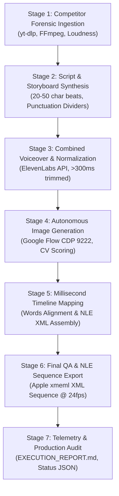

# 🚀 SOP 01: End-to-End Pipeline Execution Lifecycle

## 1. Overview & Objectives

This Standard Operating Procedure defines the end-to-end operational lifecycle for producing high-retention, animated explainer videos across multiple niches. The pipeline executes 7 sequential stages, fully managed via `2- Code/pipeline_orchestrator.py` or the interactive Web UI (`web_ui.py`).

The primary objective is **complete zero-intervention automation**: from competitor video URL ingestion or creative prompt input to an assembled Apple Final Cut Pro / Premiere Pro `xmeml` sequence with frame-accurate audio and visual pacing.

---

## 2. Multi-Niche Directory Routing Architecture

All projects are organized by niche to allow tailored tone, specialized training corpora, and distinct YouTube channel branding.

```text
d:\Tools of Jawad\25- Ink Explainers\
├── 1- Postmartum/
│   ├── history/       <- e.g. "1- What Did Ancient Humans Actually Do All Day"
│   ├── finance/       <- e.g. "1- How The Fractional Reserve Banking System Works"
│   ├── medical/       <- e.g. "1- What Happens Inside Your Body During Fever"
│   ├── horror/        <- e.g. "1- The Real Reason Sailors Feared The Mariana Trench"
│   └── engineering/   <- e.g. "1- How Jet Engines Survive Inside An Inferno"
└── 3- Finals/
    ├── history/
    ├── finance/
    ├── medical/
    ├── horror/
    └── engineering/
```

> [!NOTE]
> `config.py` automatically inspects all subfolders. If a legacy project exists directly in root `1- Postmartum/` or `3- Finals/`, the system discovers it automatically via backward-compatible fallback resolution.

---

## 3. Seven-Stage Production Lifecycle



---

### Stage 1: Ingestion & Forensic Postmortem
* **Purpose**: Deconstruct a high-performing reference or competitor video to extract pacing DNA, speech rhythm, and scene dynamics.
* **CLI Command**:
  ```powershell
  python pipeline_orchestrator.py --url "https://www.youtube.com/watch?v=..." --stage 1 --niche history
  ```
* **Artifacts Created** in `1- Postmartum/<niche>/<Project Name>/`:
  1. `video_info.json`: Metadata, channel data, views, tags, upload date.
  2. `video_low.mp4`: Low-resolution reference video for visual cadence analysis.
  3. `transcript.en-orig.vtt`: Raw YouTube subtitles.
  4. `clean_transcript.txt`: Deduplicated, punctuation-cleaned script text.
  5. `cuts_data.json`: Scene cut timestamps detected via `ffmpeg` scene filter.
  6. `audio_analysis.json`: Integrated loudness (LUFS), True Peak, and Loudness Range (LRA).
  7. `README_POSTMORTEM_REPORT.md`: Master analytical breakdown.

---

### Stage 2: Script & Stick-Figure Storyboard Synthesis
* **Purpose**: Generate a retention-optimized 7-act script and corresponding stick-figure visual prompts.
* **CLI Command**:
  ```powershell
  python pipeline_orchestrator.py --title "Project Name" --stage 2 --niche finance --prompt "How money creation works in commercial banks"
  ```
* **Pacing Standard**:
  - **Elastic Action Steps (~20–65 Characters / 1.0s–2.2s)**: Every shot represents a natural, complete cognitive thought or action step.
  - **Never-Orphan Grammar Shield**: Syntactic bonds remain intact. Never guillotine sentences mid-clause, split adjective chains, or orphan introductory adverbs.
  - **MinutePhysics / Casually Explained Visual Staging**: Prompts translate narration into concrete character actions, expressive stick figures, visual gags, and grounded environments.
  - **Decimal Protection**: Special numbers (e.g. `99.9%`, `$3.50`) are shielded so periods are not misconstrued as sentence delimiters.
* **Artifacts Created** in `3- Finals/<niche>/<Project Name>/`:
  1. `storyboard_master.csv`: 5-column database (Shot #, Start Time, Voiceover Beat, Visual Prompt, Notes).
  2. `all_prompts.txt`: Plaintext catalog of all prompts with live status markers.
  3. `PROMPT_STATUS.md`: Visual markdown tracking dashboard.

---

### Stage 3: Combined Voiceover Generation & Silence Normalization
* **Purpose**: Synthesize the full narration with high emotional fidelity and normalize silences.
* **CLI Command**:
  ```powershell
  python pipeline_orchestrator.py --title "Project Name" --stage 3
  ```
* **Operational Rules**:
  - **Always-Combined Stream**: Voiceover is generated as continuous sections via ElevenLabs (`eleven_multilingual_v2`), preserving natural human prosody.
  - **Silence Normalization**: Any pause $> 300\text{ms}$ is trimmed, leaving exactly **150ms tail cushion** after the spoken phrase and **150ms head cushion** before the next phrase.
  - **Timestamp Recalibration**: Downstream millisecond markers are adjusted sample-accurately.
* **Artifacts Created**:
  1. `Voiceovers/narration_master.mp3`: The finalized, silence-normalized master audio.
  2. `words_alignment.json`: Character- and word-level millisecond alignment dictionary.
  3. `shots_timing_alignment.json`: Exact start and end timestamps for every visual shot.

---

### Stage 4: Autonomous Image Generation via Google Flow
* **Purpose**: Generate, evaluate, and curate production-ready visual assets.
* **CLI Command**:
  ```powershell
  python pipeline_orchestrator.py --title "Project Name" --stage 4
  ```
* **Operational Rules**:
  - Requires Chrome launched with `--remote-debugging-port=9222`.
  - Connects via Playwright CDP to the active Google Flow workspace.
  - Generates 2 variations per prompt using model cascade: `Nano Banana Pro > Nano Banana 2 > Nano Banana 2 Lite`.
  - Computer vision evaluates variations for contrast, sharpness, full-bleed framing, and stick-figure compliance.
  - Accepted winning images are saved directly to `Final selected images/shot_NNN.jpg`.
  - Random pacing delay of **10–30 seconds** between shots.

---

### Stage 5: Millisecond Timeline Mapping & NLE Sequence Assembly
* **Purpose**: Synthesize an Apple `xmeml` v4 XML sequence ready for instant NLE import.
* **CLI Command**:
  ```powershell
  python pipeline_orchestrator.py --title "Project Name" --stage 5
  ```
* **Artifacts Created**:
  - `storyboard_timeline.xml`: Complete timeline sequence at 24 fps mapping Audio Track 1 to master voiceover and Video Track 1 to curated images with zero black frames.

---

### Stage 6: Final QA & Packaging
* **Purpose**: Verify asset integrity, inspect preview renders, and verify resolution compliance.
* **Verification Checks**:
  1. All shots have corresponding `shot_NNN.jpg` files in `Final selected images/`.
  2. Timeline XML imports into Premiere Pro / DaVinci Resolve without missing media.
  3. Image dimensions are exactly 1376 × 768 px (16:9).
  4. Audio loudness adheres to -12.28 to -14.0 LUFS broadcast delivery standard.

---

### Stage 7: Telemetry & Production Audit
* **Purpose**: Log run metrics, error counts, generation durations, and token usages.
* **Artifacts Created**:
  - `EXECUTION_REPORT.md`: Comprehensive timing and performance audit.
  - `production_status.json`: Live state machine readable by Web UI.

---

## 4. Web UI Production Dashboard

The Web UI provides a centralized graphical control room for starting, pausing, and monitoring stages.

* **Start Web UI**:
  ```powershell
  cd "d:\Tools of Jawad\25- Ink Explainers\2- Code"
  python web_ui.py
  ```
* **Access**: Open `http://localhost:5000` in any web browser.
* **Features**:
  - Select project and target niche from dropdown.
  - Trigger individual stages with a single click.
  - Live preview of generated images and computer vision scores.
  - Real-time terminal output stream and error notification banner.

---

## 5. Troubleshooting & Error Recovery

| Issue | Root Cause | Remediation Protocol |
| :--- | :--- | :--- |
| **CDP Connection Refused (`port 9222`)** | Chrome is not running with remote debugging enabled. | Close all Chrome instances. Run: `chrome.exe --remote-debugging-port=9222 --user-data-dir="C:\chrome_dev"` |
| **ElevenLabs Quota Exceeded** | Free tier monthly limit reached. | Check API key in `.env`. Rotate key or upgrade tier. |
| **Web UI Port 5000 in Use** | An existing background server is running. | Use `manage_task` or kill the PID using port 5000: `netstat -ano \| findstr :5000` |
| **Google Flow Stalled Generation** | Usage limit banner or modal popup. | Pipeline automatically reloads page and triggers model cascade after cooldown. See SOP 02. |

