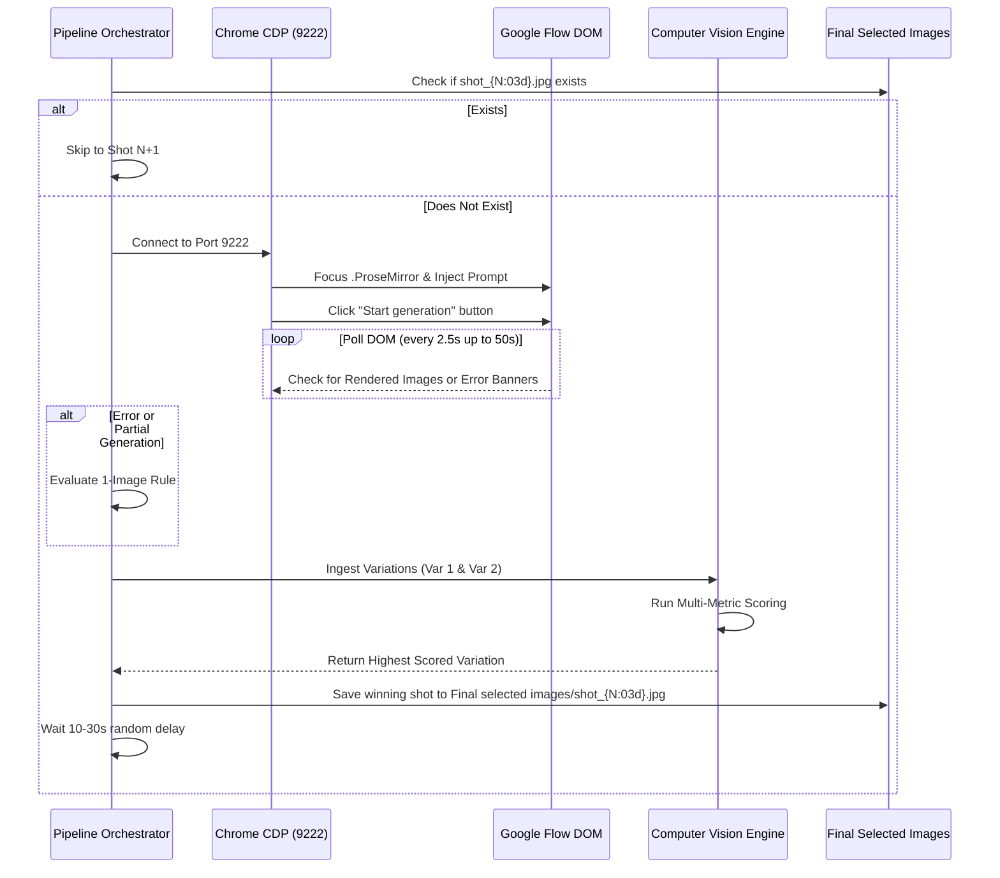

# 🎨 SOP 02: Google Flow Autonomous Image Generation & Curation

## 1. Objective & Operational Scope

This document details the standard operating procedure for autonomously generating, evaluating, and curating production-ready storyboard images via **Google Flow** using Chrome DevTools Protocol (CDP) on port 9222.

The system is engineered to operate unattended for hundreds of consecutive prompt cycles while upholding strict visual language standards (black-ink line art, white-filled stick figures, full-bleed framing) and surviving API interruptions, UI shifts, or rate limits.

---

## 2. Environment & Browser Configuration

### A. Chrome CDP Remote Debugging Launch
Google Flow automation relies on attaching Playwright to an already-authenticated Google Chrome browser instance via CDP.

1. **Launch Command (Windows PowerShell)**:
   ```powershell
   & "C:\Program Files\Google\Chrome\Application\chrome.exe" `
     --remote-debugging-port=9222 `
     --user-data-dir="C:\Users\Jawad Ahmad\AppData\Local\Google\Chrome\User Data\Default"
   ```
2. **Initial Setup**:
   - Navigate to `https://labs.google/fx/tools/flow` in the launched window.
   - Ensure the Google account is logged in and active.
   - Open or create a project workspace. Leave this tab in focus.

---

## 3. Model Architecture & Cascade Hierarchy

To guarantee zero-halt continuity during high-demand platform conditions, the pipeline utilizes a 3-tier model priority cascade:

```mermaid
graph TD
    M1["🍌 Tier 1: Nano Banana Pro\n(Optimal line precision & character adherence)"] -->|Fails 3x or Quota Hit| M2["🍌 Tier 2: Nano Banana 2\n(High-speed fallback)"]
    M2 -->|Fails 3x or Quota Hit| M3["🍌 Tier 3: Nano Banana 2 Lite\n(High-throughput safety net)"]
    M3 -->|Exhaustion (3x Failures)| HALT["HALT & User Alert\n(Save flow_error_halt.png)"]
```

* **Aspect Ratio**: `16:9` widescreen (native 1376 × 768 px).
* **Variations per Prompt**: `x2` (optimal balance between candidate diversity and rendering speed).
* **Random Pacing Interval**: `10 to 30 seconds` randomized delay between completed shots to simulate natural human operator interaction.

---

## 4. Per-Shot Execution Lifecycle

For each Shot $N$ from 1 to $M$:



### Step 1: Pre-Execution Idempotency Check
- Inspect `Final selected images/shot_{N:03d}.jpg`.
- If present, mark status as `[COMPLETED]`, skip generation, and advance immediately to Shot $N+1$.

### Step 2: Prompt Submission
- Locate the `.ProseMirror` editable element within the active Google Flow tab.
- Clear any residual text and inject the exact full-bleed prompt for Shot $N$.
- Verify that generation mode is configured to `x2` variations.
- Trigger generation by dispatching a click event to `button[aria-label="Start generation"]`.

### Step 3: DOM Monitoring & Error Detection
- Poll DOM every 2.5 seconds up to a maximum timeout of 50 seconds.
- Actively scan DOM text and banner components for failure triggers:
  - `"failed generation"`, `"something went wrong"`, `"unusual activity"`, `"generation failed"`, `"try again later"`, `"reached your usage limit"`.

### Step 4: The Partial Generation "1-Image Rule"
If an error banner appears OR the 50-second timeout occurs, but **at least 1 image successfully rendered**:
1. Download that single available image.
2. Run Computer Vision Evaluation.
3. If `score >= 50.0` (usable and passes character checks):
   - Accept it immediately as the winning image for Shot $N$.
   - Save directly to `Final selected images/shot_{N:03d}.jpg`.
   - Reset consecutive failure counters to 0.
   - Proceed to Shot $N+1$ without triggering unnecessary retry cooldowns.
4. If `score < 50.0`: Reject and proceed to the escalating cooldown protocol.

### Step 5: Escalating Failure Cooldowns & Model Shifting
When a prompt generates zero usable images:
1. **Failure 1**: Reload tab (`page.reload()`), wait **3 minutes (180s)**, and retry with current model.
2. **Failure 2**: Reload tab, wait **5 minutes (300s)**, and retry with current model.
3. **Failure 3**: Shift to the next model in the cascade (`Pro` → `2` → `2 Lite`), reset consecutive failure count to 0, wait 30 seconds for UI initialization, and retry Shot $N$.
4. **Exhaustion Halt**: If all 3 models in the cascade fail consecutively on the same shot:
   - Capture full-screen error artifact: `2- Code/flow_error_halt.png`.
   - Update `production_status.json` with status `"HALTED_CONSECUTIVE_FAILURES"`.
   - Halt pipeline execution and emit an alert for user review.

---

## 5. Multi-Metric Computer Vision Scoring Engine

Every rendered variation is evaluated by an automated OpenCV scoring pipeline to identify the superior frame:

| Metric | Weight | Measurement Technique | What It Enforces |
| :--- | :--- | :--- | :--- |
| **Sharpness & Line Clarity** | **30%** | Laplacian edge variance ($Var(\nabla^2 I)$) | Rejects blurry lines; rewards crisp high-contrast black ink outlines. |
| **Subject Prominence** | **25%** | Center-weighted threshold contrast distribution | Ensures focal stick figure or object is clear and centered. |
| **Tonal Dynamic Range** | **20%** | Histogram percentile distribution ($P_{95} - P_{5}$) | Ensures deep black values (`#000000`) on clean white canvas (`#FFFFFF`). |
| **Information Entropy** | **15%** | Shannon entropy of pixel intensity | Penalizes barren emptiness while rewarding meaningful scene detail. |
| **Stick Figure Compliance** | **10%** | Color segmentation & anatomical heuristics | **Severe Penalty (-40 pts)** if realistic human anatomy, detailed faces, or flesh tones are detected. |
| **Full-Bleed Verification** | **Penalty** | Edge pixel border uniformity check | **Severe Penalty (-50 pts)** if white matting or floating card borders are detected. |

---

## 6. Directory Destination Rules

> [!CAUTION]
> **Single Canonical Destination Rule**:  
> Winning images MUST be saved strictly to `Final selected images/shot_{N:03d}.jpg`.  
> Legacy paths such as `final_selected_images/` are deprecated and strictly forbidden.

* **Winning Image**: `Final selected images/shot_NNN.jpg`
* **Raw Variations**: `3- Finals/<niche>/<Project Name>/flow_generated_images/shot_NNN_var_1.jpg`, `..._var_2.jpg`
* **Audit Trail**: `3- Finals/<niche>/<Project Name>/selection_log.csv` (Logs timestamps, variation picked, metric breakdown, and total score).

