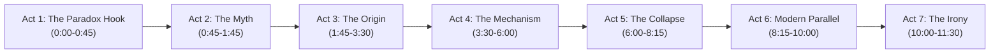

# ✍️ SOP 03: Multi-Niche Scriptwriting & Storyboard Pacing

## 1. Core Philosophy: The Fast-Paced Ink Explainer

Ink Explainer scripts are not lectures; they are **rapid visual thought-experiments**. The medium marries the deadpan, self-effacing humor of *Casually Explained* with the elegant, intuitive mechanics of *MinutePhysics*.

The core retention dynamic is driven by **relentless visual cadence**: the screen never stays static. Every sentence is fractured into bite-sized visual beats that keep the viewer's dopamine loops active.

---

## 2. Elastic Action Step Protocol (Semantic Beat Pacing)

### A. The Elastic Cadence Window (~20–65 Characters / 1.0s–2.2s)
- Pacing is untied from mechanical character guillotines. The fundamental unit of a cut is an **Atomic Action / Cognitive Thought Step**.
- An average visual shot displays for **20 to 65 characters of spoken dialogue** (approximately 1.0 to 2.2 seconds).
- Complete semantic clauses (e.g. *"and all you have to do is hike out and secure dinner."*) stay unified as a single beat. Never guillotine a sentence mid-phrase just because it passes an arbitrary character count.
- Visual monotony (>3.5s holds) is eliminated, but cognitive whiplash (0.2s–0.5s fragmented cuts) is forbidden.

### B. Natural Action-Step Boundaries & The "Never-Orphan" Grammar Shield
Cuts occur only at true cognitive and syntactic pivot points:
* **Sentence Conclusions**: Full stops (`.`), exclamation marks (`!`), question marks (`?`).
* **Independent Action Steps & Conjunctions**: Major clauses joined by conjunctions (*"You tracked a herd..."* / *"you know their exact..."* / *"and all you have to do is..."*).
* **Major Pivots**: Semicolons (`;`), colons (`:`), em-dashes (`—`).

> [!IMPORTANT]
> **The "Never-Orphan" Grammar Shield**:
> 1. **Never split an adjective series**: *"an angry, sideways, wind-whipped deluge"* is ONE dramatic weather beat, never chopped into adjective fragments.
> 2. **Never orphan introductory adverbs**: Words like *"Suddenly,"*, *"However,"*, *"Today,"*, or *"Worst of all,"* must stay glued to their following clause.
> 3. **Never split phrasal verbs or compound nouns**: *"hike out"*, *"turn into"*, *"exact coordinates"*, and *"bone sewing needles"* must remain intact.

### C. Decimal & Number Shielding
To prevent numeric decimals from triggering false cuts, the tokenizer enforces regex protection:
* `99.9%` remains a single token; the period is protected from being treated as a full stop.
* `$3.50`, `1.5 million`, `e.g.`, `i.e.`, and `U.S.` are shielded before punctuation slicing occurs.

---

## 3. The 7-Act High-Retention Story Arc

Every explainer script follows a 7-act retention architecture designed to maximize Audience Retention (AVD):



1. **Act 1: The Paradox Hook (0:00 – 0:45)**: State an undeniable contradiction about modern life vs. reality. Pose a question that feels impossible to answer simply.
2. **Act 2: The Common Misconception (0:45 – 1:45)**: Address what school, pop culture, or conventional wisdom taught the viewer — and immediately demonstrate why it is completely wrong.
3. **Act 3: The Historical Origin (1:45 – 3:30)**: Travel backward to the historical, biological, or mathematical moment this problem was first encountered.
4. **Act 4: The Hidden Mechanism (3:30 – 6:00)**: Break down the actual gears of the system using simple, visual analogies (e.g. buckets of water, stick figures passing gold coins, cavemen trading flint).
5. **Act 5: The Turning Point / Catastrophic Failure (6:00 – 8:15)**: What happens when the system breaks? Show the historical crisis, biological meltdown, or financial panic.
6. **Act 6: The Modern Parallel (8:15 – 10:00)**: Reveal that modern society is doing the exact same thing right now, just with more complex jargon and computers.
7. **Act 7: The Unresolved Irony & Epilogue (10:00 – 11:30)**: Conclude with a dry, thought-provoking philosophical observation that leaves the viewer reflecting long after the video ends.

---

## 4. Multi-Niche Tone & Archetype Guidelines

| Niche | Brand Archetype | Core Narrative Angles | Humor & Trope Style |
| :--- | :--- | :--- | :--- |
| 🏛️ **History** | *The Weary Observer* | Ancestral daily life, forgotten survival habits, evolutionary psychology, ancient hygiene, stone-age tech. | Stick-figure hunter-gatherers looking unimpressed by modern conveniences. Irony of surviving ice ages only to sit in traffic. |
| 💰 **Finance** | *The Skeptical Auditor* | Money creation, fractional reserve banking, tulip mania, hyperinflation, credit cycles, behavioral bias. | Stick figures trading increasingly absurd debt promises. Dry explanations of complex derivatives as IOUs on napkins. |
| 🩺 **Medical** | *The Cellular Commander* | Pathogen battles, immune system overkill, evolutionary mismatch, fever mechanics, neurology. | White blood cells depicted as panicked bouncers in a club. The body destroying itself to kill a common cold virus. |
| 👻 **Horror** | *The Rational Investigator* | Maritime disappearances, psychological isolation, deep-sea pressure, eerie historical coincidences. | Subtle atmospheric tension, stark high-contrast pitch-black voids, grounded stick-figure explorers encountering the unknown. |
| ⚙️ **Engineering** | *The Pragmatic Builder* | Material fatigue, catastrophic bridge failures, rocket aerodynamics, clockwork escapements. | Over-engineered stick-figure contraptions failing because someone forgot a single bolt. |

---

## 5. Stick-Figure Visual Prompt Engineering Rules

Visual prompts compiled into `storyboard_master.csv` must follow the strict **MinutePhysics / Casually Explained** design constraints:

### Mandatory Prompt Tokens
* `minimalist 2D hand-drawn ink line art comic illustration`
* `white background (#FFFFFF), crisp solid black ink lines (#000000)`
* `minimalist stick figure with a simple circular head filled with pure solid white color`
* `clean black line contour, simple stick limbs, zero realistic human anatomy, zero flesh skin tones`
* `full-bleed edge-to-edge environment grounding, no borders, no floating cards`

### Example Compliant Visual Prompts
```text
Shot 012: Minimalist 2D hand-drawn ink line art comic illustration, full bleed. A simple white-filled black-outlined stick figure sitting on a stone block looking at an empty clay ledger tablet with a confused expression. Pitch black ink contours, pure white paper background, subtle crosshatched shadows on the ground. No borders, no realistic human anatomy.
```
```text
Shot 084: Minimalist 2D hand-drawn black ink illustration. Three stick figures with circular white heads standing in front of an enormous hand-drawn bank vault door with a comically oversized padlock. Solid black linework, muted gold tint on the padlock, edge-to-edge floor linework. Full bleed, 16:9 widescreen.
```

