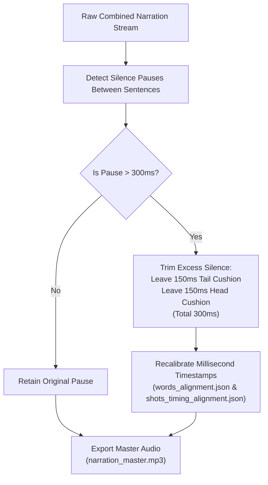

# 🎙️ SOP 04: ElevenLabs Audio Production & Mastering

## 1. Overview & Core Audio Philosophy

High viewer retention requires impeccable vocal pacing, emotional realism, and crystalline audio fidelity. Robotic cadences, awkward sentence splices, and excessive silence instantly break viewer immersion.

This SOP governs the voiceover generation pipeline, silence normalization algorithm, audio loudness targets, and NLE timeline synchronization.

---

## 2. The "Always-Combined" Voiceover Protocol

> [!CAUTION]
> **Forbidden Practice: Sentence-by-Sentence Synthesis**:  
> Never generate voiceover clips sentence-by-sentence. Doing so resets the neural acoustic model's pitch contour, produces discordant inflection jumps between adjacent lines, and eliminates natural breath rhythm.

### The Combined Stream Rule
1. The entire script (or complete narrative chapters of 500–1000 words) is passed to ElevenLabs as a continuous, unified text block.
2. The model synthesizes the narration in a single pass, establishing authentic vocal momentum, conversational micro-pauses, and contextual emphasis.
3. Word-level and character-level alignment timestamps are captured via the API's streaming metadata into `words_alignment.json`.

---

## 3. Voice Configuration & API Parameters

All parameters are configured in `2- Code/config.py` and strictly sourced from `.env`:

| Parameter | Production Value | Description |
| :--- | :--- | :--- |
| **API Key** | `ELEVENLABS_API_KEY` (from `.env`) | Secured environment token |
| **Voice Model** | `eleven_multilingual_v2` | State-of-the-art prosody, emotional nuance, and low noise |
| **Active Voice Name** | `Tyler - Clear US YouTube Creator` | Clean, youthful, engaging educational creator voice |
| **Active Voice ID** | `rPMkKgdwgIwqv4fXgR6N` | Fixed unique voice identifier |
| **Stability** | `0.45` | Slight expressiveness allowing natural conversational pitch variance |
| **Similarity Boost** | `0.85` | High vocal fidelity and accent locking |
| **Style Exaggeration** | `0.15` | Subtle dramatic flair without caricature |
| **Speaker Boost** | `True` | Enhances presence, high-frequency air, and vocal warmth |

---

## 4. The 300ms Silence Normalization Algorithm

Natural human speech contains variable pauses. However, dead air over 400ms causes YouTube viewers to drop off. The pipeline enforces an automated silence compression algorithm:

### Mathematical Formulation
For any detected pause between Sentence $k$ ending at $t_{end}(k)$ and Sentence $k+1$ starting at $t_{start}(k+1)$:
$$\Delta t_{pause} = t_{start}(k+1) - t_{end}(k)$$

If $\Delta t_{pause} > 300\text{ ms}$:
1. Compute excess duration: $\delta = \Delta t_{pause} - 300\text{ ms}$.
2. Splice audio by cutting $\delta$ from the silent region, leaving $150\text{ ms}$ immediately following $t_{end}(k)$ and $150\text{ ms}$ immediately preceding $t_{start}(k+1)$.
3. For all subsequent words and shots $i > k$:
   $$t'_{start}(i) = t_{start}(i) - \delta$$
   $$t'_{end}(i) = t_{end}(i) - \delta$$

This ensures **every downstream storyboard cut remains sample-accurate with zero phase drift**.

---

## 5. Qwen 1.7B Voice Cloning Architecture & The < 2000-Character Chapter Protocol

When utilizing local or Google Colab GPU-hosted neural voice cloning (**Qwen 1.7B / Qwen3-TTS**), the synthesis pipeline enforces strict semantic chapter chunking:

### A. The < 2000 Character Boundary Constraint
* **Hardware & Token Limit**: The Qwen 1.7B inference context accepts chunks **strictly under 2,000 characters**.
* **Target Sweet Spot**: Chunks target **1,000 to 1,800 characters** (approx. 150–260 spoken words).

### B. The Natural Thematic Pause Law (Preventing Pitch & Prosody Drift)
> [!CAUTION]
> **Forbidden Practice: Arbitrary or Mid-Sentence Splitting**:  
> Never split text at arbitrary word/character counts (e.g. every 50 words or mid-clause). In neural voice cloning, splitting mid-thought forces the acoustic model to reset its pitch contour mid-sentence, causing jarring pitch spikes, energy drops, and obvious "stitched-together" artifacts.

* **Mandatory Chapter Boundaries**: All chunk cuts **MUST** occur at **Major Narrative Act / Thematic Resolutions** (e.g., transition from the hook to the 3 threats, or from sacred fire to tool invention).
* **Terminal Punctuation Seal**: Every chunk must conclude with full terminal punctuation (`.`, `!`, `?`).
* **Organic Prosody Preservation**: Because cuts occur exclusively at major subject pivots, any slight variance in breath, tone, or acoustic inflection feels 100% natural and intentional—mirroring a documentary narrator pausing before beginning a new chapter.

### C. Standard Generation Artifacts
For every voice cloning project, Stage 3 / script preparation compiles two dedicated artifacts:
1. `qwen_voiceover_chunks.txt`: A clean, human-readable reference file detailing chunk numbers, chapter titles, character counts relative to the 2,000 limit, and clean script text for instant copy-pasting into Colab or web UI.
2. `Voiceovers/qwen_voiceover_chunks.json`: Structured JSON catalog containing array of `{chunk_id, title, char_count, word_count, text}` for programmatic API execution.

### D. Multi-Chunk Stitching & Cushioning
Audio segments generated from Qwen 1.7B chunks are concatenated with an exact **300ms silence gap** ($150\text{ ms}$ tail cushion $+ 150\text{ ms}$ head cushion) before proceeding to loudness mastering.

---

## 6. Broadcast Loudness & Mastering Standards

Before export to NLE timeline assembly, the master audio is processed through an automated FFmpeg mastering filter:

* **Integrated Loudness**: Target **-12.28 LUFS** (tolerance $\pm 0.5$ LUFS). This matches top-tier YouTube educational creators (Kurzgesagt, Casually Explained, Vox) while avoiding aggressive platform compression penalties.
* **True Peak**: Capped at **-1.0 dBFS** to prevent inter-sample clipping on mobile speakers and DACs.
* **Loudness Range (LRA)**: Maintained between **6.0 and 8.5 LU** to ensure spoken lines are consistently intelligible even in noisy listening environments.

---

## 7. Apple `xmeml` NLE Timeline Sequence Synthesis

Stage 5 compiles the master normalized audio and curated storyboard images into an industry-standard Apple `xmeml` v4 XML file (`storyboard_timeline.xml`):

* **Timebase**: `24 fps` (cinematic animation standard).
* **Audio Track 1**: Points to `Voiceovers/narration_master.mp3`.
* **Video Track 1**: Sequences `Final selected images/shot_001.jpg` through `shot_NNN.jpg`.
* **Gap-Free Guarantee**: The `out` frame of shot $N$ is mathematically identical to the `in` frame of shot $N+1$. There are zero black frames or missing clips.
* **Compatibility**: Directly importable via drag-and-drop into Adobe Premiere Pro, DaVinci Resolve, and Final Cut Pro.

