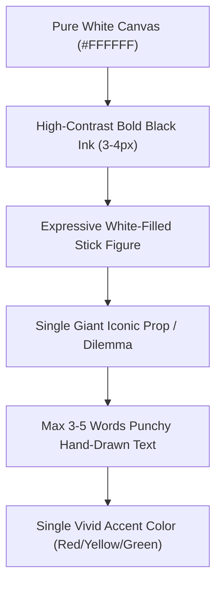

# 📦 SOP 05: YouTube Packaging, Publishing & Channel Operations

## 1. The Growth Formula: CTR × AVD = Algorithmic Velocity

An animated explainer can have perfect animation and pristine audio, but if nobody clicks, the video is dead on arrival. YouTube’s recommendation engine optimizes for two primary metrics:
1. **Click-Through Rate (CTR)**: Governed entirely by **Thumbnail + Title synergy**.
2. **Average View Duration (AVD)**: Governed by the **Hook (first 30s) + Visual Pacing (20–50 char beats)**.

This SOP outlines the production standards for packaging, channel branding, and upload execution across the multi-channel network.

---

## 2. Thumbnail Engineering Standards

All thumbnails are stored in `4- YouTube Setup/<niche>/<Channel Name>/Thumbnails/`.



### Technical Specifications
* **Dimensions**: `1280 × 720 px` (exact 16:9 ratio).
* **Format**: PNG or WebP, file size strictly under **2 MB**.
* **Contrast**: Pure `#FFFFFF` canvas with deep `#000000` ink strokes. On dark mode (which over 70% of YouTube desktop users use), a pure white thumbnail acts as a glowing beacon that draws immediate ocular focus.
* **Text Constraint**: Maximum **3 to 5 words**. Never repeat the title. The thumbnail text should be an ironic punchline, a provocative question, or a single shocking statistic (e.g. *"99.9% FAILED"*, *"FREE MONEY?"*, *"THEY KNEW"*).
* **Mobile Legibility Test**: Always scale the thumbnail down to **150 × 84 px**. If the stick figure’s emotional expression and text cannot be understood in 0.5 seconds, the thumbnail must be redesigned.

---

## 3. High-CTR Title Formulas

Titles should be between **45 and 65 characters** so they do not truncate on mobile screens:

| Formula Archetype | Pattern | Examples |
| :--- | :--- | :--- |
| **The Daily Curiosity** | *What Did [Subject] Actually Do [Context]?* | *What Did Ancient Humans Actually Do All Day?*<br>*What Did Medieval People Do When It Rained?* |
| **The Counter-Intuitive Truth** | *Why [Normal Thing] Is Actually A [Shocking Thing]* | *Why Modern Humans Work More Than Hunter-Gatherers*<br>*Why Fractional Reserve Banking Is Not What You Think* |
| **The Hidden Mechanism** | *How [Complex System] Actually Works Behind Closed Doors* | *How Banks Create Money Out Of Thin Air*<br>*How Jet Engines Survive Inside An Inferno* |
| **The Biological / Psychological Trap** | *The Reason Your Brain [Everyday Flaw]* | *Why Smart People Lose Money In Every Bubble*<br>*The Real Reason Your Body Gives You A Fever* |

---

## 4. Video Description Structure (Copy-Paste Ready)

Store finalized video metadata in `4- YouTube Setup/<niche>/<Channel Name>/Metadata/VIDEO_METADATA_<SLUG>.md`:

```text
[2-3 SENTENCE TEASER HOOK: Summarize the paradox without spoiling the punchline]

🔔 Subscribe to [Channel Name] for weekly animated breakdowns:
https://youtube.com/@[ChannelHandle]?sub_confirmation=1

--------------------------------------------------
⏱️ TIMESTAMPS
--------------------------------------------------
0:00 - The Paradox
1:15 - Chapter 1: The Initial Discovery
3:40 - Chapter 2: The Hidden Machinery
6:10 - Chapter 3: When The System Breaks
8:45 - Chapter 4: Modern Day Echoes
11:20 - The Irony of Progress

--------------------------------------------------
📚 SOURCES & ACADEMIC CITATIONS
--------------------------------------------------
1. [Book Title] — [Author]
2. [Academic Journal Paper] — [Link / DOI]
3. [Historical Archive Reference]

--------------------------------------------------
🎨 PRODUCTION CREDITS
--------------------------------------------------
• Animation & Visual Storyboarding: [Channel Name] Studio
• Narrative & Script: [Channel Name] Team
• Voiceover: Tyler (ElevenLabs Neural Audio Engine)
• Software: Google Antigravity, Google Flow, FFmpeg

--------------------------------------------------
💬 JOIN THE DISCUSSION
[Engaging open-ended question related to the video topic to encourage viewer comments]

📬 Business inquiries & syndication: [channel_email]@gmail.com

#[NicheTag1] #[NicheTag2] #[NicheTag3] #Animation #Educational
```

---

## 5. Pre-Publishing QA: "The Unlisted Protocol"

Never publish a video directly to `Public`. Follow the 6-step unlisted verification workflow:

1. **Upload as `Unlisted`**:
   - Upload the master MP4 file at least 4 hours before the target public launch time.
2. **HD & 4K Processing Confirmation**:
   - Verify that YouTube Studio shows the blue "HD" and "4K" icons complete. Never launch while the video is only available in 360p or 480p.
3. **Audio-Sync & Silence Audit**:
   - Play the unlisted video at 1.0x and 1.5x speed to verify that storyboard cuts land with millisecond precision on dialogue breaks with no audio stutter.
4. **End Screens & Info Cards**:
   - Add "Best for Viewer" Video element in the final 20 seconds.
   - Add Subscribe button element in the final 20 seconds.
5. **Pinned Comment Insertion**:
   - Write and pin a top comment highlighting a provocative question to ignite the comment section within the first 10 minutes of release.
6. **Switch to `Public`**:
   - Release at the channel's historical peak traffic window (typically Tuesday or Thursday between 14:00 and 16:00 EST).

