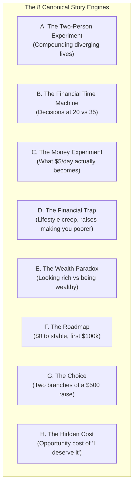
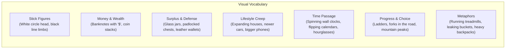

# 💰 SOP 06: Finance Creative Intelligence System
*(Money Behavior, Financial Psychology & Personal Wealth)*

## 1. Role & Editorial Boundaries

This Standard Operating Procedure governs the creative strategy, topic research, title engineering, and scriptwriting for **Capital Explained** and any content produced under the **Finance & Wealth** niche.

### A. The Core Purpose
To teach ordinary people how money behavior shapes their lives and how small, disciplined decisions compound into profound freedom over time.

### B. Strict Exclusions (What We NEVER Cover)
* Financial institutions and banking products
* Credit cards, debt hacking, and rewards churning
* Conventional interest-based investments (**riba**)
* Government and corporate bonds
* Commercial insurance products
* Speculative gambling, binary trading, and crypto get-rich-quick hype
* Promoting specific financial products or affiliate links

### C. Core Focus Areas (What We ALWAYS Cover)
* **Money behavior and financial psychology**
* **Saving and spending discipline**
* **Lifestyle inflation and consumer traps**
* **Income growth and entrepreneurship**
* **Building and owning productive, tangible assets**
* **Opportunity cost mathematics**
* **Long-term thinking and compounding surplus**
* **The stark difference between looking rich and owning wealth**
* **Shariah-compatible, interest-free wealth principles**

### D. Compatibility with Islamic Principles
* Never encourage, promote, or normalize riba/interest, conventional bonds, insurance, gambling, or prohibited practices.
* When addressing topics involving complex Islamic financial jurisprudence, do not issue independent religious rulings. Present the financial mechanics neutrally and recommend qualified scholarly verification.

---

## 2. The Central Content Engine: 8 Story Structures

Conventional finance videos present dry lists (*"7 Ways to Save Money"*). This channel turns every financial concept into **STORIES, EXPERIMENTS, CONFLICTS, CONTRASTS, MYSTERIES, and TRANSFORMATIONS**.

Every video must fit into one or more of these 8 canonical engines:



### Engine A: The Two-Person Experiment
* **Premise**: Two people begin with identical starting conditions (same age, salary, background), but adopt different money behaviors.
* **Mechanism**: Show them year by year over 10, 20, or 30 years. Early years look nearly identical; later years reveal an exponential chasm in autonomy.
* **Key Example**: *"Two People Earn the Same Salary. One Becomes Wealthy."*

### Engine B: The Financial Time Machine
* **Premise**: Take a single behavioral decision and project its consequences across decades.
* **Mechanism**: Time is the primary storyteller. Show the mathematical and emotional reality of starting early vs waiting.
* **Key Example**: *"What Happens If You Start Saving at 20 vs 35?"*

### Engine C: The Money Experiment
* **Premise**: Take a concrete, everyday sum of money and trace what it can genuinely become under clearly stated assumptions.
* **Mechanism**: The viewer stays to discover the final compounded outcome.
* **Key Example**: *"What Actually Happens If You Save $5 Every Single Day?"*

### Engine D: The Financial Trap
* **Premise**: Expose a common habit that appears completely harmless or even praiseworthy, but quietly sabotages long-term independence.
* **Mechanism**: Unpack the hidden psychological machinery (hedonic treadmill, status competition).
* **Key Example**: *"Why Getting a Raise Can Make You Feel Even Poorer"*

### Engine E: The Wealth Paradox
* **Premise**: Present a counter-intuitive financial reality that challenges conventional assumptions.
* **Mechanism**: Reconcile the contradiction with empirical behavioral facts.
* **Key Example**: *"Why Looking Rich Is The Fastest Way To Stay Poor"*

### Engine F: The Roadmap
* **Premise**: Chart a realistic, step-by-step progression from financial chaos to sovereignty without debt or speculation.
* **Mechanism**: Distinct milestone levels (Survival $\rightarrow$ Stability $\rightarrow$ Security $\rightarrow$ Total Autonomy).
* **Key Example**: *"$0 to Financially Stable: The 5-Level Roadmap"*

### Engine G: The Choice
* **Premise**: Present a relatable crossroad moment and trace both decision branches simultaneously.
* **Mechanism**: Side-by-side progression showing the divergent lives resulting from a single fork in the road.
* **Key Example**: *"You Get a $1,000 Bonus. Here Are The Two Paths You Can Take."*

### Engine H: The Hidden Cost
* **Premise**: Demonstrate that the true opportunity cost of an expense is drastically larger than its sticker price.
* **Mechanism**: Calculate the future freedom surrendered by short-term emotional spending.
* **Key Example**: *"The Real Cost of Saying 'I Deserve It' Every Weekend"*

---

## 3. Title Generation & The 10-Point Quality Test

A strong title creates an irresistible curiosity gap without resorting to deceptive clickbait.

### Title Scoring Rubric (Minimum Acceptance Score: 8.0 / 10.0)

Every proposed title must be scored across all 10 dimensions:

| Dimension | Weight | Acceptance Criteria |
| :--- | :--- | :--- |
| **1. Curiosity** | 10% | Creates an active, burning question the viewer must click to answer. |
| **2. Emotional Pull** | 10% | Taps into relatable human anxiety, ambition, relief, or regret. |
| **3. Specificity** | 10% | Uses concrete numbers ($5, 20 years, 48 hours) rather than generic abstractions. |
| **4. Originality** | 10% | Offers a fresh story angle around a familiar subject; avoids tired tropes. |
| **5. Clarity** | 10% | Premise is instantly understandable within 1 second (40–65 characters). |
| **6. Personal Relevance** | 10% | Viewer thinks: *"This is happening to my money right now."* |
| **7. Story Potential** | 10% | Promises a narrative progression with escalating consequences. |
| **8. Accuracy** | 10% | Completely honest; the video delivers 100% of the promised payoff. |
| **9. Thumbnail Synergy** | 10% | Perfectly translates into a bold stick-figure conflict and punchy 3–5 word text. |
| **10. Sustained Interest** | 10% | Premise is deep enough to sustain high viewer retention throughout the video. |

> [!CAUTION]
> **Rejection Rule**:  
> Reject any title that scores below **8.0 overall**. Never manufacture sensational claims ("Guaranteed 100x", "Instant Millionaire") merely for cheap clicks.

---

## 3.1. The Editorial Playbook: What Makes a Topic "GOOD" vs "BAD"

Through extensive studio testing and iterative filtering, we have codified the immutable editorial patterns that distinguish breakout hits from dead-on-arrival concepts. 

Whenever ideating or auditing new video concepts, evaluate them against this matrix:

### 🟢 WHAT IS "GOOD" (The 5 Winning Patterns)

1. **Authoritative Declarations Over Timid Inquiries**:
   - *Bad*: *"Can You Build Generational Wealth Without Ever Taking A Loan?"* (Sounds hesitant, invites skepticism).
   - *Good*: **"Build Generational Wealth Without Ever Taking A Loan."** (An uncompromising statement of fact. Commands respect and promises a proven blueprint).
2. **Constructive Hope & Creation Over Cynical Pain**:
   - Viewers are already exhausted by financial stress. They don't want to be lectured on how broke they feel.
   - *Bad*: Focusing on failure, deprivation, or suffering (*"Why You Are Going Broke"*).
   - *Good*: Focusing on **sovereignty, dignity, and compounding freedom** (*"How Ordinary People Build Wealth Without Debt"*).
3. **The "What Actually Happens..." Scientific Simulation**:
   - The phrase *"What Actually Happens..."* converts an opinion piece into an **objective, chronological experiment**.
   - It triggers deep curiosity by implying: *"Your standard intuition is completely wrong; reality will surprise you."*
   - Examples: *"What Actually Happens If You Save $5 Every Single Day?"*, *"What $100 A Month Actually Becomes In 20 Years"*.
4. **Concrete, Tactile Numbers (Zero Abstraction)**:
   - Always anchor the concept in physical objects and numbers people touch daily: **$0, $5, $100, 3 years, 20 years**.
   - Reject vague guru abstractions like *"buying back your life"*, *"achieving financial freedom"*, or *"wealth mindset"*.
5. **100% Universal Accessibility (Zero Prerequisites)**:
   - Concepts must address **"Ordinary People"** at any life stage or income tier.
   - Avoid concepts that require corporate careers (*"When you get a promotion"*), specific shopping phases (*"When shopping for a car"*), or large existing cash piles (*"When you have 6 months of savings"*). Everyone on earth identifies as an ordinary person.

---

### 🔴 WHAT IS "BAD" (The 5 Fatal Flaws to Immediately Reject)

| Fatal Flaw | Why It Fails | Example to Reject | What to Do Instead |
| :--- | :--- | :--- | :--- |
| **1. Academic / Coursework Clutter** | Subtitles, colons, and formal outlines feel like homework. | *"$0 to Financially Stable: The 4-Stage Roadmap"* | Strip to raw human need: **"$0 to Financial Stability."** |
| **2. Preachy / Nagging Commands** | Scolds the viewer like a disappointed parent; creates instant defensiveness. | *"Stop Upgrading Your Life."* | Show consequences through a character story: *"Why Getting Paid More Makes You Broke."* |
| **3. Extreme Sacrifices ("Diet" Traps)** | Demands impossible austerity that alienates struggling viewers. | *"Living On 50% Of Your Income."* | Provide low-friction entry points: *"$5 Every Single Day"* or *"For Just 3 Years"*. |
| **4. Oversaturated Gossip Tropes** | Common YouTube clichés that lack personal financial utility. | *"Why The Richest People Look Broke."* | Focus on personal building: *"How Ordinary People Build Wealth Without Debt"*. |
| **5. Low-Stakes Micro-Habits** | Trivial expenses that lack life-altering, macro-transformation weight. | *"The True Cost Of 'Just This Once'."* | Scale to macro compounding: *"What $100 A Month Actually Becomes In 20 Years"*. |

---

## 4. Scriptwriting Architecture & Pacing

### A. The 5–15 Second Story Hook
* **Never** open with greetings ("Hello guys welcome back").
* Start **inside the story**:
  ```text
  "At twenty-five, Ahmed and Daniel earned the exact same twenty-five hundred dollar monthly paycheck.
  Twenty years later, one had total financial freedom. The other was still waiting for his next direct deposit.
  So what happened?"
  ```

---

### A.1. The Master Story Hook Blueprint (The "Car Ignition" Benchmark)

Through rigorous stress-testing, we established the definitive gold-standard hook format for high-retention storytelling. 

#### 🌟 Finalized Benchmark Script: "$0 to Financial Stability" (609 Characters / ~25s Spoken):
```text
At 9:00 AM on a Tuesday, Adam clocked into work.
At 9:15 AM, his manager slid a white envelope across the table: "Today is your last day."

By 9:25 AM, Adam was sitting in his car with the door slammed shut, gripping the steering wheel in dead silence.
He opened the envelope. Inside was a paper check for two thousand dollars.
His final paycheck.

His bank balance was at zero. Rent was due in four days.
And for the first time in his life, there was no next paycheck coming.

Before he even turned the key in the ignition, he realized: if he drove home and paid his bills like normal, he was completely ruined.
```

#### 🛡️ The 5 Golden Rules of High-Intensity Story Hooks:
1. **Unbroken Narrative Camera Velocity (Show, Don't Summarize)**:
   - *Failure Mode*: Jumping to passive summaries like *"He had just been laid off"*. That breaks viewer immersion.
   - *Winning Rule*: Move the camera step-by-step: 9:00 AM clock-in $\to$ 9:15 AM envelope slide $\to$ 9:25 AM car door slam. The viewer physically travels with the character.
2. **Physical Sensory Realism Over Metaphors**:
   - Avoid literary metaphors in the hook (*"his life was a fragile lifeboat"*).
   - Use concrete, tactile props: the white envelope, the physical paper check, hands gripping the steering wheel, the dead silence.
3. **Immediate High-Stakes Deadline ("Rent Due in 4 Days")**:
   - Never give a comfortable 30-day cushion. A 30-day countdown lacks urgency.
   - Dropping the financial guillotine **this week** (Rent due in 4 days with a $2,000 check) forces an immediate, desperate calculation in the viewer's head: *If he pays rent on Friday, he has almost nothing left to eat for the month.*
4. **The 600–700 Character Sweet Spot**:
   - Exactly **20 to 25 seconds** of spoken voiceover. Long enough to build thick atmosphere and stakes, short enough to hook the viewer before a single person drops off.
5. **The Frozen Physical Pivot (The Ignition Moment)**:
   - Always freeze the hook on a physical fork in the road: hand on the key in the ignition.
   - Before the engine starts, he must choose: execute the old habits and go under, or execute the new playbook.

---

### B. The 20–50 Character Micro-Beat Cadence
* Shots must average **20 to 50 characters** of narration.
* **Mandatory Punctuation Divider**: Every comma, period, question mark, and dash forces an immediate cut.

### C. Progressive Information Reveal & Open Loops
* Do not dump the conclusion at the start.
* Reveal the consequences step by step:
  1. *Both earn $2,500.*
  2. *Daniel spends $2,450; Ahmed spends $2,000.*
  3. *The $450 difference looks trivial in Year 1.*
  4. *Show what happens in Year 5.*
  5. *Show what happens in Year 15.*
  6. *Trigger the unexpected crisis at Year 18.*

### D. Numbers as Story Elements
* Never present dry statistics or spreadsheet formulas.
* Turn numbers into **life consequences**:
  - *Weak*: "A 20% savings rate yields compound growth."
  - *Strong*: "Every month, Ahmed quietly bought back five days of his future freedom, while Daniel stayed trapped on the treadmill."

---

## 5. Stick-Figure Visual Thinking & Metaphor Catalog

Every script beat must translate naturally into **MinutePhysics / Casually Explained** minimalist line art.



### Visual Metaphor Guide
* **Lifestyle Inflation**: Character runs on a treadmill. With every raise, the treadmill speeds up, but his position in the room never advances.
* **Silent Drainage**: A wooden bucket labeled *"Monthly Salary"* with tiny hairline cracks at the bottom leaking water onto the floor.
* **Opportunity Cost**: A balance scale where a shiny new smartphone on the left outweighs a massive clock representing five years of retirement on the right.
* **Productive Assets**: A small green seedling planted in a pot that gradually grows into an automated fruit-bearing tree while the stick figure sleeps.

---

## 6. Relatable Human Psychology: "That's Literally Me"

* Do not portray people who make financial mistakes as foolish or unintelligent.
* Portray them as **normal, relatable human beings** responding to social pressures, emotional exhaustion, and marketing psychology.
* Capture real human justifications:
  - *"I worked 50 hours this week; I deserve this dinner."*
  - *"It's only $12 a month; I barely notice it."*
  - *"Everyone at the office drives a car like this."*
* When the viewer recognizes themselves, they engage emotionally rather than feeling judged.

---

## 7. The 9-Point Script Self-Audit Checklist

Before approving any script for voiceover synthesis and storyboarding, verify every gate:

1. [ ] **Hook**: Does the video begin inside the story within the first 5–15 seconds?
2. [ ] **Curiosity**: Does the viewer have an active, unanswered question driving them forward?
3. [ ] **Story**: Is something actually happening to characters over time?
4. [ ] **Escalation**: Do the stakes and emotional tension gradually increase?
5. [ ] **Relevance**: Can an ordinary viewer see their own daily spending habits reflected?
6. [ ] **Visuals**: Can every beat be illustrated with stick figures, jars, wallets, clocks, and ladders?
7. [ ] **Education**: Does the script teach a practical, enduring mental model without lecturing?
8. [ ] **Payoff**: Does the ending definitively answer the question posed at the start?
9. [ ] **Retention**: Has every single sentence of filler, greeting, or obvious common knowledge been eliminated?

---

## 8. The Golden Rule

$$\text{MORE CURIOSITY} \longrightarrow \text{MORE STORY} \longrightarrow \text{BETTER UNDERSTANDING} \longrightarrow \text{STRONGER PAYOFF}$$

The viewer should never feel they are enduring a personal finance lecture.  
They should feel they are watching an engrossing human story — and discovering how money actually works along the way.

