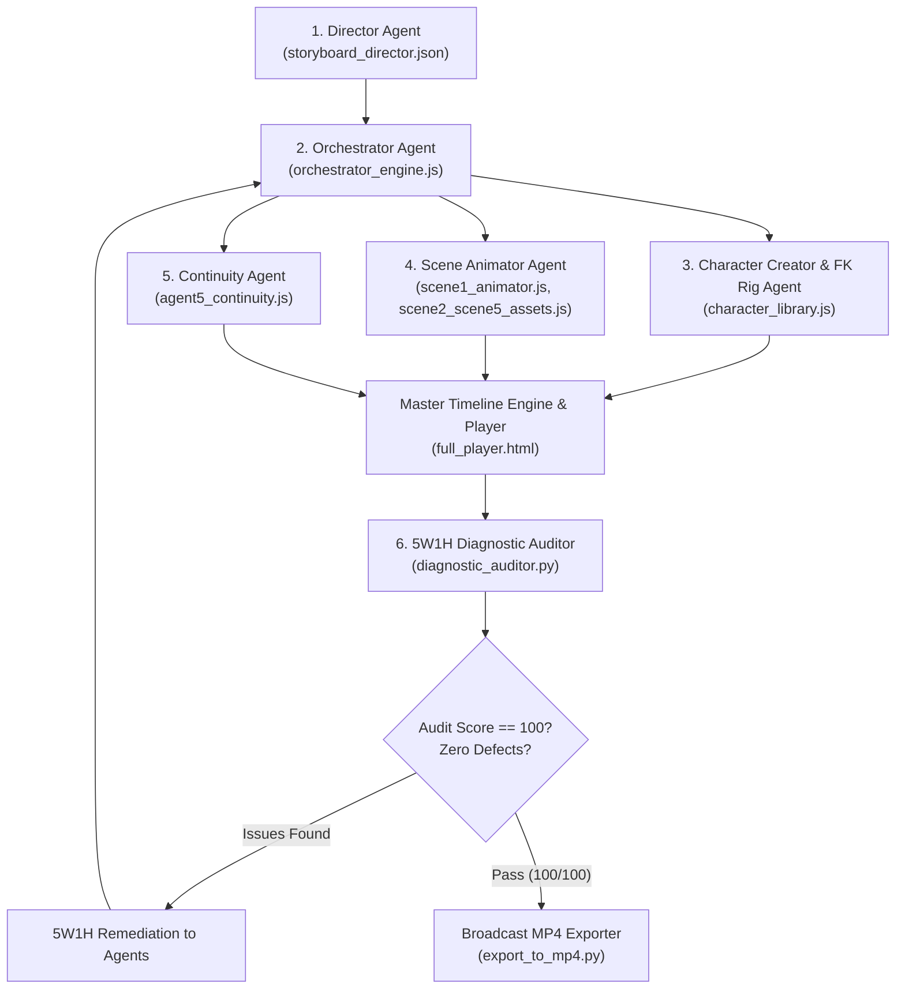

# 📋 SOP 07: Infographic Vector Animation & Motion Graphics Pipeline

> **Autonomous Studio Standard Operating Procedure**  
> **Domain:** 2D Motion Graphics, Vector Explainer Animation (*The Infographics Show* Style)  
> **Lifecycle:** Director Scripting $\rightarrow$ Orchestrator Zoning $\rightarrow$ FK Character Rigging $\rightarrow$ Scene Assembly $\rightarrow$ Continuity Transitions $\rightarrow$ 5W1H Diagnostic Auditing $\rightarrow$ MP4 Broadcast Mastering

---

## 🎯 Purpose & Scope

This document codifies the operational rules, mathematical invariants, architectural standards, and automated diagnostic gates required to produce high-retention 2D infographic explainer animations.

Adherence to this SOP eliminates the historical defects encountered during autonomous production:
1. **Broken playback buttons** (audio promise rejection).
2. **Tangled or twisted character limbs** (backward elbows, 360° spins, floating detached props).
3. **Overflown text and duplicate subtitle pills**.
4. **Transition popping and premature scene cuts**.
5. **Misaligned trajectory props** (rockets/arrows failing to follow path tangents).
6. **Illogical visual metaphors** (floating teeth without mouth cutouts).
7. **Uninformative audit logs** (pass/fail without root cause or remediation steps).

---

## 🏛️ 1. The 6-Agent Production Hierarchy

Every infographic explainer is constructed by a decentralized 6-agent pipeline coordinated by clear protocol boundaries:



### Agent Responsibility Matrix

| Agent | Module / File | Core Responsibility | Immutable Boundary |
| :--- | :--- | :--- | :--- |
| **1. Director Agent** | `storyboard_director.json`, `SCRIPT_VOICEOVER.md` | Story beats, audio duration, pacing, voiceover narrative arc, SFX markers. | Defines *what* happens and *when*; does not write rendering code. |
| **2. Orchestrator Agent** | `orchestrator_engine.js` | Spatial zones, curve math & tangents, single-source-of-truth chunked captions. | Owns all text chunking and curve trajectory formulas. |
| **3. Character FK Rig Agent** | `character_library.js` | Biomechanical Forward Kinematics, joint angle bounds, prop attachment. | Renders characters only; never draws scene backgrounds or HUD badges. |
| **4. Scene Animator Agent** | `scene1_animator.js`, `scene2_scene5_assets.js` | Environment, props, rolling odometers, kinetic infographics, monsters. | Never renders subtitles; must respect Orchestrator spatial zones. |
| **5. Continuity Agent** | `agent5_continuity.js` | Camera motion, zoom punches, whip pans, 50% midpoint screen mask handovers. | Governs scene transitions; never alters internal scene element states. |
| **6. 5W1H Diagnostic Auditor** | `diagnostic_auditor.py` | Playwright DOM inspection, text bounds testing, 5W1H structured defect reports. | Must provide exact root cause and step-by-step fix; never gives a raw fail. |

---

## ⚡ 2. The 7 Immutable Laws of Vector Animation

Any violation of these 7 laws triggers an immediate automatic rejection in the diagnostic auditor:

### Law 1: The Biomechanical Forward Kinematics (FK) Law
* **Problem Solved:** Tangled hands, backward elbows, floating detached banknotes, torso collisions.
* **Invariant:** Human limbs **MUST NEVER** be drawn using arbitrary bezier curves or freehand polygons. Limbs must be calculated via rigid forward kinematics:
  $$\alpha_s = 90^\circ \pm \theta_s, \quad E = S + L_1 \begin{pmatrix} \cos\alpha_s \\ \sin\alpha_s \end{pmatrix}$$
  $$\alpha_f = \alpha_s \pm \theta_e, \quad W = E + L_2 \begin{pmatrix} \cos\alpha_f \\ \sin\alpha_f \end{pmatrix}$$
* **Joint Limits (Strict Biomechanical Safety):**
  - **Elbow Flexion:** $\theta_e \in [0^\circ, 140^\circ]$. Elbows can **only** flex upward/inward toward the chest/head. Negative angles (backward hyperextension) are mathematically prohibited.
  - **Shoulder Rotation:** $\theta_s \in [-45^\circ, +170^\circ]$. 360° spinning shoulders are prohibited.
  - **Knee Flexion:** $\theta_k \in [0^\circ, 110^\circ]$ (backward flexion only).
* **Prop Sandwiches:** Handheld props (e.g. $5 banknote) must be anchored to wrist coordinates $(W_x, W_y)$ and visually rendered **between** the palm and the front curled fingers. Disconnected floating props are strictly prohibited.

---

### Law 2: The Single-Source-of-Truth Caption Law
* **Problem Solved:** Subtitles rendering twice simultaneously; text overflowing background pills.
* **Invariant A (Zero Duplication):** Scene animators are **forbidden** from rendering `<text>` subtitles inside their scene functions. Only `orchestrator_engine.js:renderChunkedCaptions(t)` may emit subtitles.
* **Invariant B (Chunking Limits):** Subtitle chunks are restricted to a maximum of **3 to 4 words** per chunk.
* **Invariant C (Pill Padding):** Every subtitle pill and informational badge must maintain a minimum inner clearance of:
  $$\text{Width}_{\text{pill}} \ge \text{Width}_{\text{text}} + 40\text{px}$$

---

### Law 3: The 50% Midpoint Transition Handover Law
* **Problem Solved:** Visual popping, background flickering, or scene elements changing before the screen is masked.
* **Invariant:** During any scene transition $T_{A \to B}$ running over $[t_{\text{start}}, t_{\text{end}}]$:
  - Base Scene $A$ remains active for progress $p \in [0.0, 0.50)$.
  - Exactly at $p = 0.50$ (the midpoint), the transition effect (whip pan, wipe, climax starburst) must achieve **100% full screen coverage**.
  - Base Scene $B$ activates at $p \ge 0.50$.
  - Under no circumstances may Scene $B$ appear before $p = 0.50$.

---

### Law 4: The Trajectory Tangent Law
* **Problem Solved:** Propelled objects (rockets, vehicles, arrows, coins) flying sideways or statically on curved paths.
* **Invariant:** Any object traveling along a parameterized curve $\mathbf{B}(t) = (x(t), y(t))$ must compute its exact rotation angle from the first derivative (velocity vector):
  $$\theta(t) = \text{atan2}\left(\frac{dy}{dt}, \frac{dx}{dt}\right) \times \frac{180}{\pi}$$
* For quadratic Bézier curves defined by $P_0, P_1, P_2$:
  $$\mathbf{B}'(t) = 2(1-t)(P_1 - P_0) + 2t(P_2 - P_1)$$

---

### Law 5: The Semantic Geometry Law
* **Problem Solved:** Abstract or nonsense shapes (e.g. a solid red circle with floating surface triangles labeled "monster").
* **Invariant:** Any animated creature or machine must possess genuine mechanical or anatomical geometry:
  - A mouth that bites **must** have an authentic angular cutout wedge (`M 0 0 L ux uy A R R 0 1 1 lx ly Z`).
  - Teeth must be placed along the jawlines and interleave cleanly when the mouth angle closes ($\theta \approx 4^\circ$).
  - Labels must be anchored to the body with distinct high-contrast backings and clean letter-spacing.

---

### Law 6: The Dual-Clock Player Architecture Law
* **Problem Solved:** Play button clicking but doing nothing because HTML5 Audio promise was blocked or rejected by the browser.
* **Invariant:** Video players must maintain **two synchronized clocks**:
  1. **Primary Clock:** `audio.currentTime` (used when audio is playing).
  2. **Fallback Clock:** A high-precision `requestAnimationFrame` timestamp accumulator (`fallbackTime += dt`) that takes over instantly if audio is muted, absent, or promise-rejected.
* The Play/Pause button must toggle `isPlaying` state immediately regardless of audio hardware availability.

---

### Law 7: The 5W1H Actionable Audit Law
* **Problem Solved:** Auditors giving unhelpful "Test Failed" outputs that leave downstream agents guessing.
* **Invariant:** Every diagnostic check must output a structured 5W1H entry:
  - **What:** Exact defect type (e.g. `TEXT_BOUNDS_OVERFLOW`, `HYPEREXTENDED_ELBOW`).
  - **Where:** DOM selector, coordinate tuple, and node hierarchy.
  - **When:** Exact timeline timestamp $t$ down to the centisecond.
  - **Why:** Technical root cause explanation (e.g. pill width was 520px but text was 550px).
  - **How to Fix:** Step-by-step code correction instructions with required parameters.

---

## 📐 3. Screen Zoning & Spatial Topology (1920 × 1080)

To prevent visual collisions between hero characters, props, badges, and subtitles, all scenes must respect the standard spatial zones defined in `orchestrator_engine.js`:

```text
+-------------------------------------------------------------------------+
| (0,0)                           1920x1080                        (1920,0)|
|                                                                         |
|   ZONE_HUD_TOP: Badges, Odometers, Stamps (Y: 100 - 280)               |
|                                                                         |
|   ZONE_CHARACTER_LEFT         ZONE_PROP_CENTER      ZONE_ACTION_RIGHT   |
|   Hero Character              Cash Stack, Vault     Monster, Rocket     |
|   X: 300 - 550                X: 800 - 1100         X: 1050 - 1800      |
|   Y: 400 - 850                Y: 420 - 700          Y: 200 - 750        |
|                                                                         |
|   ZONE_SUBTITLES: Chunked Subtitle Pill (X: 960, Y: 920 - 980)          |
|                                                                         |
+-------------------------------------------------------------------------+
```

---

## 🛠️ 4. Build, Validation & Export Protocol

When creating or modifying any infographic explainer, follow this mandatory 4-step sequence:

```bash
# Step 1: Compile Modular JS Assets into Standalone HTML Player
python "zz- Infographic Experiment/build_player.py"

# Step 2: Run Headless 5W1H Diagnostic Audit
python "zz- Infographic Experiment/diagnostic_auditor.py"
# (Must achieve Score: 100/100 with 0 issues)

# Step 3: Human Verification Model Sheet Gate
# Open character_model_sheet.html and inspect 5 canonical poses & FK wireframes.

# Step 4: Export Broadcast MP4
python "zz- Infographic Experiment/export_to_mp4.py"
# (Generates 1920x1080 30fps H.264 MP4 with muxed AAC voiceover)
```

---

## 📦 5. Standard Deliverable Checklist

A production run is only deemed complete when the following assets exist and pass QA:

- [x] **`full_player.html`**: Zero-CORS, standalone double-clickable HTML5 player with dual-clock support.
- [x] **`character_library.js`**: Forward Kinematics skeletal rig with preset turnarounds.
- [x] **`character_model_sheet.html`**: Standalone studio UI with live joint sliders and wireframe toggle.
- [x] **`DIAGNOSTIC_AUDIT_REPORT.md`**: 100/100 audit report with timestamped beat verifications.
- [x] **`The_5_Dollar_Daily_Habit.mp4`**: 1080p 30fps H.264 broadcast video file with synced studio voiceover.
- [x] **`launch_player.bat`**: 1-click Windows desktop launcher.
